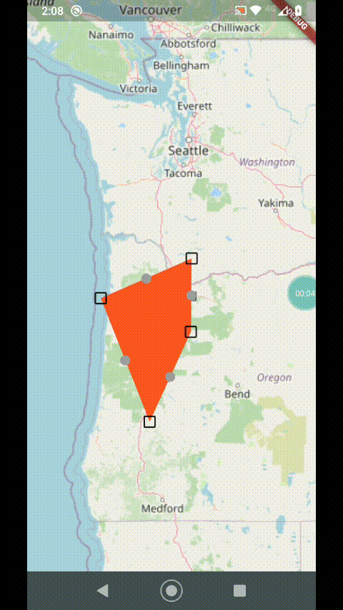

# Line & Polygon Editor for `flutter_map`

[![pub package][pub_badge]][pub_link]
[![License: MIT][license_badge]][license_link]
[![Support me on Ko-fi][kofi_badge]][kofi_link]

A basic line and polygon editor that works with
[`flutter_map`](https://github.com/fleaflet/flutter_map/), relying on
`DragMarker` from
[`flutter_map_dragmarker`](https://github.com/ibrierley/flutter_map_dragmarker).




## Getting started

To use this package, first add `flutter_map_line_editor` as a
[dependency in your `pubspec.yaml` file][using-packages-link]:

```yaml
dependencies:
  flutter_map_line_editor: <latest version>
```

See the `example` directory for a complete example app demonstrating the usage
of this package, here are the most important features:

- Tap the map to add a marker, add as many as you want.
- Drag the main points to move them.
- Drag the intermediate points to create a new point there and drag to where you
  want.
- Long press to delete a point.

## Usage

Once the package is installed, make sure to import the package in the file that
you are going to need it, you may also need to import `flutter_map_dragmarker`:

```dart
import 'package:flutter_map_dragmarker/flutter_map_dragmarker.dart';
import 'package:flutter_map_line_editor/flutter_map_line_editor.dart';
```

Set up a new editor instance, tipically inside `initState()`:

```dart
var polyEditor = PolyEditor(
  points: testPolyline.points,
  pointIcon: Icon(Icons.crop_square, size: 23),
  intermediateIcon: Icon(Icons.lens, size: 15, color: Colors.grey),
  callbackRefresh: () => { this.setState(() {})},
  addClosePathMarker: false, // set to true if polygon
  addLineStartMarker: true, // set to false, to remove first marker of line
  addLineEndMarker: true, // set to false, to remove last marker of line
);
```

The `PolyEditor` takes a list of `LatLng` points that are used to put
`DragMarker`'s over these locations. `PolyEditor` does not care if the given
list of points is a polyline, it could be something else. This list will be
edited in place so that when the build method is triggered it will use updated
points.

You must also pass a `Widget` (tipically an `Icon`) using the `pointIcon`
parameter that will be used to represent each `DragMarker`.

You may also pass the optional parameter `intermediateIcon`to display another
`DragMarker` halfway between the main points. Dragging this marker will create
another main point and the line will be split.

The screen needs to be updated during a drag, so `callbackRefresh` takes a
function that will get called each drag frame.

For polygons or “closed paths” set the parameter `addClosePathMarker` to `true`
so that the end auto-returns to the start. Otherwise, if you just want a basic
polyline, set this to false.

You can add a point programmatically using the `onTap` callback in `MapOptions`:

```dart
onTap: (ll) {
  polyEditor.add(testPolyline.points, ll);
},
```

Add the correspondent layers as `FlutterMap` childrens:

```dart
FlutterMap(
  options: MapOptions(
    onTap: (_, ll) {
      polyEditor.add(testPolyline.points, ll);
    },
  ),
  children: [
    // .....
    PolylineLayer(polylines: polyLines),
    DragMarkers(markers: polyEditor.edit()),
  ],
),
```

> Report issues or feature requests in the [GitHub repository][issue-tracker],
> Pull Requests are welcome!

## License

This package is licensed under the permissive [MIT License][mit-license-link].
See the [`LICENSE`][license-link] file in this repository to get a full copy.

[license_badge]: https://img.shields.io/badge/license-MIT-blue.svg
[license_link]: https://opensource.org/licenses/MIT
[mit-license-link]: https://mit-license.org/
[license-link]: https://raw.githubusercontent.com/ibrierley/flutter_map_line_editor/master/LICENSE
[pub_badge]: https://img.shields.io/pub/v/flutter_map_line_editor.svg
[pub_link]: https://pub.dartlang.org/packages/flutter_map_line_editor
[kofi_badge]: https://ko-fi.com/img/githubbutton_sm.svg
[kofi_link]: https://ko-fi.com/F1F8E2YBE
[using-packages-link]: https://docs.flutter.dev/packages-and-plugins/using-packages
[issue-tracker]: https://github.com/ibrierley/flutter_map_line_editor/issues
